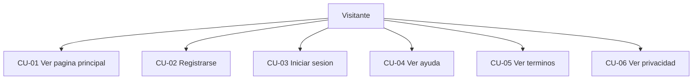
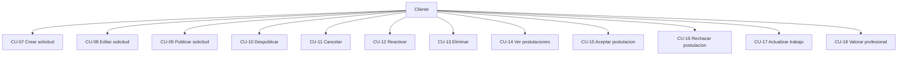
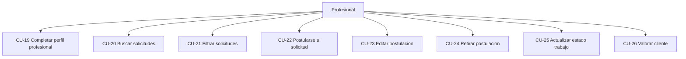
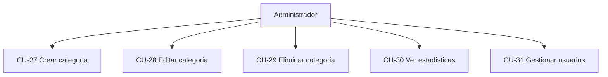
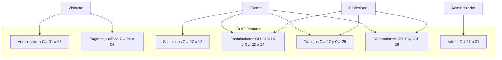
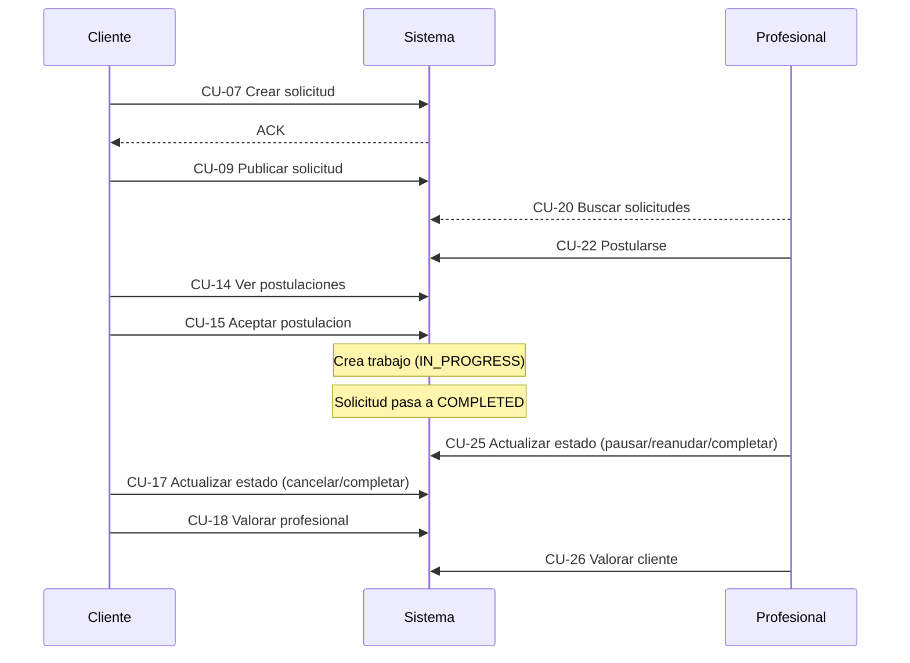

# Diagrama de Casos de Uso - DUIT

**Descripción de Casos de Uso, Actores y Flujos del Sistema**

---

## 📋 Metadatos del Documento

| Dato                  | Valor                                                  |
| --------------------- | ------------------------------------------------------ |
| **Autores**           | Aleixo Fernández Cuevas, Cristo Manuel Navarro Martín  |
| **Nombre de archivo** | DAW_PRW_R1L2_UT01.2 Diagrama de casos de uso           |
| **Fecha de versión**  | 16/02/2026                                             |
| **Ciclo Formativo**   | Desarrollo de Aplicaciones Web - Semipresencial (DAWN) |
| **Módulo**            | Proyecto de Desarrollo de Aplicaciones Web (PRW)       |
| **Versión**           | 3.0                                                    |

---

## 📖 Tabla de Contenidos

1. [Introducción y Contexto del Proyecto](#1-introducción-y-contexto-del-proyecto)
2. [Historias de Usuario](#2-historias-de-usuario)
3. [Actores del Sistema](#3-actores-del-sistema)
4. [Casos de Uso por Actor](#4-casos-de-uso-por-actor)
5. [Diagrama General de Casos de Uso](#5-diagrama-general-de-casos-de-uso)
6. [Relaciones entre Casos de Uso](#6-relaciones-entre-casos-de-uso)
7. [Reglas de Negocio Aplicadas](#7-reglas-de-negocio-aplicadas)
8. [Diagrama de Secuencia del Flujo Principal](#8-diagrama-de-secuencia-del-flujo-principal)
9. [Tabla de Trazabilidad](#9-tabla-de-trazabilidad)
10. [Reparto de Tareas y Responsabilidades](#10-reparto-de-tareas-y-responsabilidades)

---

## 📝 Historial de Revisiones

| Fecha      | Descripción                              | Autores                             |
| ---------- | ---------------------------------------- | ----------------------------------- |
| 21/12/2025 | Fase de análisis. Versión inicial        | Aleixo F. Cuevas / Cristo N. Martín |
| 10/01/2026 | Primera corrección                       | Aleixo F. Cuevas / Cristo N. Martín |
| 01/02/2026 | Segunda corrección                       | Aleixo F. Cuevas / Cristo N. Martín |
| 16/02/2026 | Tercera corrección y reformateo completo | Aleixo F. Cuevas                    |

---

## 1. Introducción y Contexto del Proyecto

El presente documento describe el diagrama de casos de uso correspondiente al proyecto de desarrollo de la aplicación web DUIT, elaborado durante la fase de análisis funcional y diseño del sistema. Los casos de uso presentados representan las interacciones principales entre los usuarios y el sistema.

---

## 2. Historias de Usuario

### Usuario No Registrado

- Como visitante, quiero acceder a la página principal para conocer las funcionalidades de la plataforma
- Como visitante, quiero registrarme en la plataforma para acceder a las funcionalidades como cliente o profesional
- Como visitante, quiero iniciar sesión para acceder a mi área privada
- Como visitante, quiero consultar páginas informativas (ayuda, términos, privacidad) para entender la política de la plataforma

### Usuario Cliente

- Como cliente, quiero crear una solicitud de servicio para encontrar profesionales que resuelvan mi necesidad
- Como cliente, quiero publicar mi solicitud para que los profesionales puedan verla y postularse
- Como cliente, quiero revisar las postulaciones recibidas para evaluar a los profesionales disponibles
- Como cliente, quiero aceptar una postulación para asignar el trabajo a un profesional
- Como cliente, quiero actualizar el estado del trabajo para comunicar el progreso al profesional
- Como cliente, quiero valorar al profesional para contribuir a su reputación en la plataforma

### Usuario Profesional

- Como profesional, quiero registrarme en la plataforma para ofrecer mis servicios
- Como profesional, quiero completar mi perfil profesional para que los clientes conozcan mi experiencia
- Como profesional, quiero buscar solicitudes relevantes para encontrar oportunidades de trabajo
- Como profesional, quiero postularme a una solicitud para mostrar interés en un trabajo
- Como profesional, quiero actualizar el estado del trabajo para comunicar el progreso al cliente
- Como profesional, quiero valorar al cliente para contribuir a la confianza en la plataforma

### Administrador

- Como administrador, quiero gestionar las categorías de servicios para mantener un catálogo actualizado
- Como administrador, quiero ver estadísticas del sistema para monitorear su funcionamiento
- Como administrador, quiero gestionar usuarios para mantener la integridad del sistema

---

## 3. Actores del Sistema

### 3.1 Usuario No Registrado (Visitante)

**Descripción:** Usuario que accede a la plataforma sin autenticación

**Objetivo:** Conocer la plataforma y registrarse o iniciar sesión

**Características:**

- Puede acceder a páginas públicas
- Puede ver información general del sistema
- Puede acceder a formularios de registro y login

### 3.2 Usuario Cliente

**Descripción:** Usuario registrado que requiere servicios profesionales

**Objetivo:** Publicar solicitudes y encontrar profesionales adecuados

**Características:**

- Acceso a área privada autenticada
- Puede crear y gestionar solicitudes
- Puede revisar postulaciones y seleccionar profesionales
- Puede actualizar estado de trabajos y emitir valoraciones

### 3.3 Usuario Profesional

**Descripción:** Usuario registrado que ofrece servicios profesionales

**Objetivo:** Encontrar oportunidades de trabajo y construir reputación

**Características:**

- Acceso a área privada autenticada
- Puede completar perfil profesional
- Puede buscar y postularse a solicitudes
- Puede actualizar estado de trabajos y emitir valoraciones

### 3.4 Administrador

**Descripción:** Usuario con permisos elevados para gestionar el sistema

**Objetivo:** Mantener el sistema operativo y consistente

**Características:**

- Acceso a panel administrativo
- Puede gestionar categorías
- Puede ver estadísticas (futuro)
- Puede gestionar usuarios (futuro)

---

## 4. Casos de Uso por Actor

### 4.1 Casos de Uso - Usuario No Registrado

| ID    | Caso de Uso          | Descripción                           |
| ----- | -------------------- | ------------------------------------- |
| CU-01 | Ver página principal | Acceder a la página de inicio de DUIT |
| CU-02 | Registrarse          | Crear nueva cuenta en el sistema      |
| CU-03 | Iniciar sesión       | Autenticarse en la plataforma         |
| CU-04 | Ver ayuda            | Acceder a página de ayuda             |
| CU-05 | Ver términos         | Consultar términos de servicio        |
| CU-06 | Ver privacidad       | Consultar política de privacidad      |

### 4.2 Casos de Uso - Usuario Cliente

| ID    | Caso de Uso               | Descripción                                                        |
| ----- | ------------------------- | ------------------------------------------------------------------ |
| CU-07 | Crear solicitud           | Crear nueva solicitud de servicio                                  |
| CU-08 | Editar solicitud          | Modificar solicitud en borrador                                    |
| CU-09 | Publicar solicitud        | Hacer visible una solicitud a profesionales                        |
| CU-10 | Despublicar solicitud     | Ocultar una solicitud activa                                       |
| CU-11 | Cancelar solicitud        | Cancelar definitivamente una solicitud                             |
| CU-12 | Reactivar solicitud       | Reactivar una solicitud cancelada                                  |
| CU-13 | Eliminar solicitud        | Borrar una solicitud                                               |
| CU-14 | Ver postulaciones         | Revisar postulaciones recibidas                                    |
| CU-15 | Aceptar postulación       | Seleccionar profesional y crear trabajo                            |
| CU-16 | Rechazar postulación      | Desestimar postulación de profesional                              |
| CU-17 | Actualizar estado trabajo | Cambiar estado del trabajo asignado (pausar, cancelar o completar) |
| CU-18 | Valorar profesional       | Emitir puntuación y comentarios al profesional                     |

### 4.3 Casos de Uso - Usuario Profesional

| ID    | Caso de Uso                  | Descripción                                                                  |
| ----- | ---------------------------- | ---------------------------------------------------------------------------- |
| CU-19 | Completar perfil profesional | Configurar datos profesionales                                               |
| CU-20 | Buscar solicitudes           | Explorar solicitudes disponibles                                             |
| CU-21 | Filtrar solicitudes          | Refinar búsqueda por categoría o ubicación                                   |
| CU-22 | Postularse a solicitud       | Enviar propuesta con presupuesto                                             |
| CU-23 | Editar postulación           | Modificar postulación pendiente                                              |
| CU-24 | Retirar postulación          | Eliminar postulación pendiente                                               |
| CU-25 | Actualizar estado trabajo    | Cambiar estado del trabajo (iniciar, pausar, reanudar, completar o cancelar) |
| CU-26 | Valorar cliente              | Emitir puntuación y comentarios al cliente                                   |

### 4.4 Casos de Uso - Administrador

| ID    | Caso de Uso        | Descripción                            |
| ----- | ------------------ | -------------------------------------- |
| CU-27 | Crear categoría    | Añadir nueva categoría de servicios    |
| CU-28 | Editar categoría   | Modificar categoría existente          |
| CU-29 | Eliminar categoría | Borrar categoría de servicios          |
| CU-30 | Ver estadísticas   | Consultar métricas del sistema         |
| CU-31 | Gestionar usuarios | Ver y administrar usuarios del sistema |

---

## 5. Diagrama General de Casos de Uso

---

## 6. Relaciones entre Casos de Uso

### 6.1 Relaciones de Herencia (Generalización)

**CU-07 (Crear solicitud) generaliza:**

- CU-08: Editar solicitud (especialización)
- CU-09: Publicar solicitud (especialización)

### 6.2 Relaciones de Inclusión (<<include>>)

- **CU-09 (Publicar solicitud) incluye CU-03 (Iniciar sesión)** - Requiere autenticación
- **CU-15 (Aceptar postulación) incluye creación de trabajo** - Genera el trabajo asociado
- **CU-22 (Postularse) incluye CU-03 (Iniciar sesión)** - Requiere autenticación

### 6.3 Relaciones de Extensión (<<extend>>)

- **CU-20 (Buscar solicitudes) se extiende por CU-21 (Filtrar)** - Extensión opcional
- **CU-17 (Actualizar trabajo) se extiende por CU-18 (Valorar)** - Post-completación

---

## 7. Reglas de Negocio Aplicadas en Casos de Uso

1. **Autenticación Obligatoria:** Todos los CU excepto CU-01 a 06 requieren usuario autenticado
2. **Ciclo de Vida de Solicitudes:** DRAFT ↔ PUBLISHED → COMPLETED/CANCELLED (reactivar devuelve a DRAFT)
3. **Postulación Única:** Un profesional no puede postularse dos veces a la misma solicitud
4. **Selectores Únicos:** Solo un profesional puede ser seleccionado por solicitud
5. **Valoración Post-Completación:** Las valoraciones solo se pueden emitir tras trabajo completado
6. **Permisos por Rol:** Las operaciones están restringidas al rol correspondiente
7. **Estados Persistentes:** Los cambios de estado son permanentes e irreversibles
8. **Auditoría:** Todos los cambios se registran con usuario y fecha

---

## 8. Diagrama de Secuencia del Flujo Principal

### Flujo: Cliente Crea Solicitud y Profesional la Completa

---

## 9. Tabla de Trazabilidad

| Requisito (UT01.1)           | Casos de Uso        | Controladores (UT02)    | Entidades                  |
| ---------------------------- | ------------------- | ----------------------- | -------------------------- |
| RF-01: Registro usuario      | CU-02               | PublicController        | AppUser, UserRole          |
| RF-02: Autenticación         | CU-03               | PublicController        | AppUser, AccessLog         |
| RF-03: Crear solicitud       | CU-07, CU-08, CU-09 | RequestFormController   | ServiceRequest             |
| RF-04: Gestionar solicitudes | CU-10 a 13          | RequestFormController   | ServiceRequest             |
| RF-05: Ver postulaciones     | CU-14               | RequestFormController   | JobApplication             |
| RF-06: Aceptar postulación   | CU-15               | PostulacionesController | ServiceJob, JobApplication |
| RF-07: Buscar solicitudes    | CU-20, CU-21        | ProfessionalController  | ServiceRequest, Category   |
| RF-08: Postularse            | CU-22, CU-23, CU-24 | PostulacionesController | JobApplication             |
| RF-09: Actualizar trabajo    | CU-17, CU-25        | MyRequestsController    | ServiceJob                 |
| RF-10: Valorar               | CU-18, CU-26        | RatingsController       | Rating                     |
| RF-11: Gestionar categorías  | CU-27 a 29          | AdminController         | Category                   |
| RF-12: Ver estadísticas      | CU-30               | AdminController         | Estadísticas               |
| RF-13: Gestionar usuarios    | CU-31               | AdminController         | AppUser                    |

---

## 10. Reparto de Tareas y Responsabilidades

La elaboración del presente Documento de Casos de Uso se ha realizado de forma colaborativa.

**Aleixo Fernández Cuevas:**

- Elaboración inicial del documento
- Definición de actores y casos de uso
- Creación del diagrama general
- Revisión final

**Cristo Manuel Navarro Martín:**

- Colaboración en la identificación de historias de usuario
- Definición de relaciones entre casos de uso
- Validación de trazabilidad con requisitos
- Revisión técnica

---

**Última actualización:** 16 de febrero de 2026 
**Versión:** 3.0
