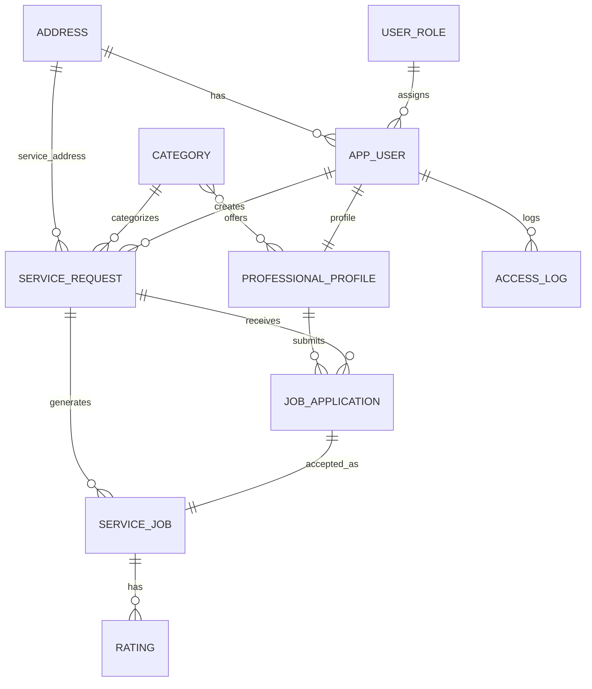
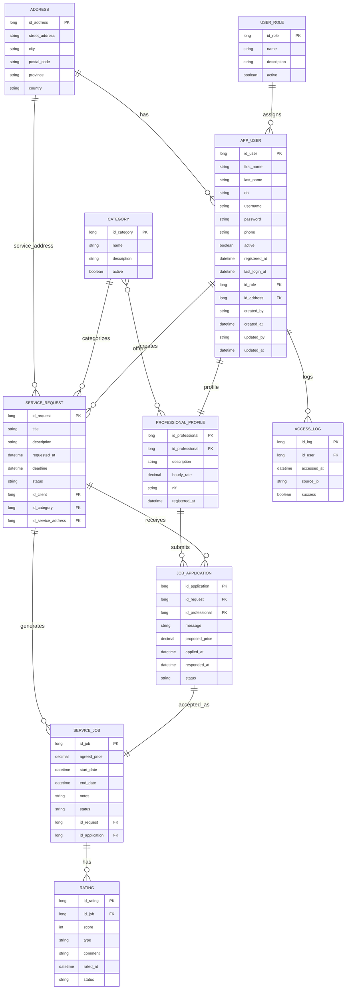

# Diagrama E/R - DUIT

**Modelo de Datos Relacional - Sistema de Plataforma de Servicios en Línea**

---

##  Metadatos del Documento

| Campo               | Valor                                                  |
| ------------------- | ------------------------------------------------------ |
| **Archivo**         | DAW_PRW_R1L2_UT01.3 - Diagrama E/R                     |
| **Ciclo Formativo** | Desarrollo de Aplicaciones Web - Semipresencial (DAWN) |
| **Módulo**          | Proyecto de Desarrollo de Aplicaciones Web (PRW)       |
| **Autores**         | Aleixo Fernández Cuevas, Cristo Manuel Navarro Martín  |
| **Fecha Actual**    | 23/02/2026                                             |
| **Versión**         | 3.0                                                    |
| **Estado**          | Fase de Implementación - Esquema Validado              |

---

##  Tabla de Contenidos

1. [Introducción Ejecutiva](#1-introducción-ejecutiva)
2. [Objetivo del Modelo de Datos](#2-objetivo-del-modelo-de-datos)
3. [Identificación de Entidades](#3-identificación-de-entidades)
4. [Descripción del Diagrama Relacional](#4-descripción-del-diagrama-relacional)
5. [Justificación del Diseño](#5-justificación-del-diseño)
6. [Especificación Detallada de Entidades](#6-especificación-detallada-de-entidades)
7. [Relaciones entre Tablas Intermedias](#7-relaciones-entre-tablas-intermedias)
8. [Reglas de Negocio e Integridad Referencial](#8-reglas-de-negocio-e-integridad-referencial)
9. [Máquina de Estados del Sistema](#9-máquina-de-estados-del-sistema)
10. [Consideraciones Técnicas de Implementación](#10-consideraciones-técnicas-de-implementación)
11. [Índices Implementados en la Base de Datos](#11-índices-implementados-en-la-base-de-datos)
12. [Especificaciones Detalladas de Base de Datos PostgreSQL](#12-especificaciones-detalladas-de-base-de-datos-postgresql)
13. [Notas Adicionales y Consideraciones Futuras](#13-notas-adicionales-y-consideraciones-futuras)
14. [Reparto de Tareas y Responsabilidades](#14-reparto-de-tareas-y-responsabilidades)

---

##  Tabla de Historial de Revisiones

| Fecha      | Descripción                                      | Autores                            |
| ---------- | ------------------------------------------------ | ---------------------------------- |
| 21/12/2025 | Fase de análisis. Versión inicial                | Aleixo F. Cuevas, Cristo N. Martín |
| 10/01/2026 | Primera corrección                               | Aleixo F. Cuevas, Cristo N. Martín |
| 01/02/2026 | Segunda corrección                               | Aleixo F. Cuevas, Cristo N. Martín |
| 16/02/2026 | Tercera corrección y reformateo completo         | Aleixo F. Cuevas                   |
| 24/02/2026 | Cuarta corrección                                | Aleixo F. Cuevas, Cristo N. Martín |

---

## 1. Introducción Ejecutiva

El modelo se ha realizado a partir de los requisitos definidos en las fases anteriores del proyecto y del diagrama de casos de uso desarrollado en la UT01.2.

El objetivo principal de este documento es mostrar cómo se organiza la información del sistema, definiendo las entidades, sus atributos y las relaciones entre ellas, de forma que sirva como base para la implementación de la base de datos del proyecto.

### Diagrama E/R - Tablas de la Base de Datos




---

## 2. Objetivo del Modelo de Datos

El objetivo del modelo de datos es definir cómo se va a almacenar y relacionar la información que utilizará la aplicación. Este diseño permite:

- **Gestionar usuarios** con distintos roles (clientes, profesionales, administradores, moderadores)
- **Crear y seguir solicitudes** de trabajo
- **Asignar trabajos** a los profesionales
- **Realizar valoraciones** una vez finalizado un servicio

El sistema asegura que los datos se mantengan organizados y sin duplicidades, garantizando la integridad referencial en todo momento.

---

## 3. Identificación de Entidades

Tras analizar el funcionamiento del sistema y los requisitos definidos, se han identificado las entidades necesarias para representar la información y los procesos principales de la aplicación.

### 3.1. Entidades Principales

Se consideran entidades principales aquellas que representan los elementos clave del funcionamiento del sistema y sobre las que se articulan los principales procesos de la aplicación.

| Entidad            | Descripción                                                                                                                                                   |
| ------------------ | ------------------------------------------------------------------------------------------------------------------------------------------------------------- |
| **AppUser**        | Representa a cualquier persona que utiliza el sistema, independientemente de su rol (cliente, profesional, administrador o moderador)                         |
| **ServiceRequest** | Representa una petición de servicio creada por un cliente, que puede recibir postulaciones por parte de profesionales                                         |
| **JobApplication** | Representa la propuesta realizada por un profesional para llevar a cabo una solicitud concreta, actuando como paso intermedio entre la solicitud y el trabajo |
| **ServiceJob**     | Representa el servicio que se realiza una vez que una postulación ha sido aceptada                                                                            |

### 3.2. Entidades Secundarias

Se consideran entidades secundarias aquellas que complementan a las entidades principales del sistema, aportando información adicional necesaria para su funcionamiento. Estas entidades no representan procesos principales por sí mismas, pero permiten ampliar y organizar los datos de forma estructurada.

| Entidad                 | Propósito                                                  |
| ----------------------- | ---------------------------------------------------------- |
| **UserRole**            | Clasificar a los usuarios según su rol en el sistema       |
| **Category**            | Agrupar los servicios disponibles en categorías            |
| **Address**             | Asociar información de localización                        |
| **ProfessionalProfile** | Almacenar información específica de perfiles profesionales |
| **Rating**              | Registrar valoraciones entre usuarios                      |
| **AccessLog**           | Proporcionar auditoría de accesos                          |

### 3.3. Consideraciones Generales

- Cada entidad cuenta con una clave primaria que permite identificar de forma única cada registro dentro del sistema
- Las relaciones entre entidades se gestionan mediante claves foráneas, garantizando la integridad referencial de los datos y la coherencia del modelo
- Todas las entidades principales heredan de `BaseEntity`, excepto `AccessLog`. `BaseEntity` proporciona campos de auditoría automática (`created_by`, `created_at`, `updated_by`, `updated_at`), permitiendo un seguimiento completo de los cambios realizados en el sistema

---

## 4. Descripción del Diagrama Relacional

El modelo de datos del sistema se ha representado mediante un diagrama relacional utilizando la notación Crow's Foot, en el que se muestran las entidades identificadas, sus atributos principales, las claves primarias y las claves foráneas que definen las relaciones entre ellas.

El diagrama refleja la estructura de la base de datos diseñada para la aplicación, permitiendo visualizar de forma clara las relaciones y cardinalidades entre las distintas entidades, así como la dependencia existente entre los procesos principales del sistema.

### Estructura Central del Modelo

En el modelo se distingue una entidad central, **AppUser**, a partir de la cual se articulan el resto de entidades del sistema:

- A través de esta entidad se gestionan los distintos roles
- Se asocian las direcciones
- En el caso de los profesionales, se almacena la información específica en el perfil profesional

El diagrama representa el **flujo completo del proceso principal** de la aplicación:

1. Creación de una solicitud por parte de un cliente
2. Postulaciones realizadas por los profesionales
3. Generación del trabajo una vez aceptada una postulación
4. Posterior valoración entre las partes implicadas

Este diagrama sirve como referencia directa para la implementación de la base de datos en PostgreSQL, garantizando la coherencia entre el diseño conceptual y la estructura física de las tablas, así como la correcta aplicación de las restricciones de integridad definidas.

---

## 5. Justificación del Diseño

### Entidad AppUser como Núcleo del Sistema

Se ha optado por una única entidad `AppUser` como núcleo del modelo, concentrando en ella la información común a todos los perfiles del sistema. La diferenciación de permisos y comportamientos se realiza mediante la entidad `UserRole`, lo que permite:

- Gestionar distintos tipos de usuarios sin duplicar estructuras ni datos
- Simplificar el mantenimiento del sistema
- Mejorar la consistencia de la información
- Facilitar la incorporación de nuevos roles en el futuro

### Separación entre ServiceRequest, JobApplication y ServiceJob

La separación responde a la necesidad de representar correctamente el ciclo de vida de los servicios ofrecidos en la plataforma:

- Una solicitud puede recibir **múltiples postulaciones** por parte de profesionales
- No todas ellas derivan en un trabajo
- El trabajo únicamente se genera cuando una postulación es **aceptada**
- Permite reflejar de forma realista el proceso de selección y ejecución del servicio
- Evita un modelo rígido y poco flexible

### Entidad ProfessionalProfile

Se ha diseñado para almacenar información específica de los usuarios que ofrecen servicios:

- Descripción profesional
- Precio por hora
- NIF

De este modo, se evita incluir campos innecesarios en la entidad `AppUser` para aquellos perfiles que no desempeñan actividades profesionales, manteniendo un diseño más limpio y modular.

### Entidad Address

Se ha separado de la entidad `AppUser` para:

- Permitir un registro progresivo de los datos
- Mejorar la flexibilidad del sistema
- Asociarse de forma opcional a cada usuario
- Permitir que el registro inicial sea sencillo
- Permitir que la información de localización se complete posteriormente cuando sea necesario
- Reutilizar direcciones para las solicitudes de servicio, donde se indica el lugar donde se realizará el trabajo

### Entidad Rating

Garantiza que las opiniones entre clientes y profesionales estén siempre vinculadas a trabajos reales y finalizados:

- Refuerza la integridad de los datos
- Mejora la fiabilidad del sistema
- Evita valoraciones arbitrarias
- Asegura un sistema de reputación coherente
- El sistema permite valoraciones bidireccionales, donde tanto el cliente como el profesional pueden evaluar su experiencia mutua

### Entidad AccessLog

Proporciona trazabilidad completa de los accesos al sistema, registrando información relevante como:

- IP de origen
- Fecha y hora
- Éxito o fallo del intento de acceso

Esto contribuye a la seguridad y auditoría del sistema.

---

## 6. Especificación Detallada de Entidades

El presente apartado describe de forma detallada el modelo de datos del sistema Duit, compuesto por 10 entidades principales.

### Diagrama E/R - Detalle de Tablas (Atributos completos)




### 6.1. Resumen de Entidades del Sistema

| Nº  | Entidad             | Tipo      | Descripción             |
| --- | ------------------- | --------- | ----------------------- |
| 1   | AppUser             | Núcleo    | Usuarios del sistema    |
| 2   | UserRole            | Núcleo    | Roles y permisos        |
| 3   | Address             | Núcleo    | Direcciones             |
| 4   | ProfessionalProfile | Núcleo    | Perfil profesional      |
| 5   | Category            | Núcleo    | Categorías de servicios |
| 6   | ServiceRequest      | Flujo     | Solicitudes de servicio |
| 7   | JobApplication      | Flujo     | Postulaciones           |
| 8   | ServiceJob          | Flujo     | Trabajos asignados      |
| 9   | Rating              | Soporte   | Valoraciones            |
| 10  | AccessLog           | Auditoría | Registro de accesos     |

### 6.2. AppUser (Usuario de la Aplicación)

#### Atributos

| Campo         | Tipo          | Restricciones    | Descripción               |
| ------------- | ------------- | ---------------- | ------------------------- |
| id_user       | Long          | PK, Auto         | Identificador del usuario |
| first_name    | String(100)   | NOT NULL         | Nombre                    |
| last_name     | String(150)   | NOT NULL         | Apellidos                 |
| dni           | String(9)     | UNIQUE           | DNI                       |
| username      | String(100)   | NOT NULL, UNIQUE | Email                     |
| password      | String(255)   | NOT NULL         | Contraseña cifrada        |
| phone         | String(20)    | NULL             | Teléfono                  |
| active        | Boolean       | DEFAULT TRUE     | Estado                    |
| registered_at | LocalDateTime | NULL             | Registro                  |
| last_login_at | LocalDateTime | NULL             | Último acceso             |
| id_role       | Long          | FK               | Rol                       |
| id_address    | Long          | FK               | Dirección                 |
| created_by    | String(100)   | NULL             | Creado por                |
| created_at    | LocalDateTime | NULL             | Creación                  |
| updated_by    | String(100)   | NULL             | Actualizado por           |
| updated_at    | LocalDateTime | NULL             | Actualización             |

#### Relaciones

| Tipo      | Entidad             |
| --------- | ------------------- |
| ManyToOne | UserRole            |
| ManyToOne | Address             |
| OneToOne  | ProfessionalProfile |
| OneToMany | ServiceRequest      |
| OneToMany | AccessLog           |

### 6.3. UserRole (Rol de Usuario)

#### Atributos

| Campo       | Tipo        | Restricciones | Descripción   |
| ----------- | ----------- | ------------- | ------------- |
| id_role     | Long        | PK            | Identificador |
| name        | ENUM        | UNIQUE        | Rol           |
| description | String(100) | NULL          | Descripción   |
| active      | Boolean     | DEFAULT TRUE  | Estado        |

#### Valores ENUM

| Rol          | Descripción                                         |
| ------------ | --------------------------------------------------- |
| ADMIN        | Administrador                                       |
| USER         | Cliente                                             |
| PROFESSIONAL | Profesional                                         |
| MODERATOR    | Moderador (reservado, sin uso en la versión actual) |

### 6.4. Address (Dirección)

#### Atributos

| Campo          | Tipo        | Restricciones            | Descripción   |
| -------------- | ----------- | ------------------------ | ------------- |
| id_address     | Long        | PK                       | Identificador |
| street_address | String(200) | NOT NULL                 | Calle         |
| city           | String(100) | NOT NULL                 | Ciudad        |
| postal_code    | String(5)   | NULL                     | Código Postal |
| province       | String(100) | NOT NULL                 | Provincia     |
| country        | String(50)  | NOT NULL, DEFAULT España | País          |

### 6.5. ProfessionalProfile (Perfil Profesional)

#### Atributos

| Campo           | Tipo          | Restricciones    | Descripción |
| --------------- | ------------- | ---------------- | ----------- |
| id_professional | Long          | PK/FK            | Usuario     |
| description     | TEXT          | NOT NULL         | Descripción |
| hourly_rate     | Decimal(8,2)  | NOT NULL         | EUR/hora    |
| nif             | String(9)     | NOT NULL, UNIQUE | NIF         |
| registered_at   | LocalDateTime | NULL             | Registro    |

### 6.6. Category (Categoría)

#### Atributos

| Campo       | Tipo        | Restricciones    | Descripción   |
| ----------- | ----------- | ---------------- | ------------- |
| id_category | Long        | PK               | Identificador |
| name        | String(100) | NOT NULL, UNIQUE | Nombre        |
| description | String(200) | NULL             | Descripción   |
| active      | Boolean     | DEFAULT TRUE     | Estado        |

### 6.7. ServiceRequest (Solicitud)

#### Atributos

| Campo              | Tipo          | Restricciones | Descripción        |
| ------------------ | ------------- | ------------- | ------------------ |
| id_request         | Long          | PK            | Identificador      |
| title              | String(150)   | NOT NULL      | Título             |
| description        | TEXT          | NOT NULL      | Descripción        |
| requested_at       | LocalDateTime | NULL          | Fecha de solicitud |
| deadline           | LocalDateTime | NULL          | Fecha límite       |
| status             | ENUM          | NOT NULL      | Estado             |
| id_client          | Long          | FK            | Cliente            |
| id_category        | Long          | FK            | Categoría          |
| id_service_address | Long          | FK (NULL)     | Dirección          |

#### Estados

| Estado      | Descripción |
| ----------- | ----------- |
| DRAFT       | Borrador    |
| PUBLISHED   | Publicada   |
| IN_PROGRESS | En progreso |
| COMPLETED   | Completada  |
| CANCELLED   | Cancelada   |
| EXPIRED     | Expirada    |

**Nota importante:** Los estados `IN_PROGRESS` y `EXPIRED` están definidos en el modelo de datos, pero no se asignan automáticamente en la versión actual. El flujo actual implementa: `DRAFT` → `PUBLISHED` → `COMPLETED` (al aceptar postulación) o `CANCELLED` (por el cliente).

### 6.8. JobApplication (Postulación)

#### Atributos 

| Campo           | Tipo          | Restricciones | Descripción          |
| --------------- | ------------- | ------------- | -------------------- |
| id_application  | Long          | PK            | Identificador        |
| id_request      | Long          | FK            | Solicitud            |
| id_professional | Long          | FK            | Profesional          |
| message         | TEXT          | NULL          | Mensaje              |
| proposed_price  | Decimal(8,2)  | NULL          | Precio propuesto     |
| applied_at      | LocalDateTime | NULL          | Fecha de postulación |
| responded_at    | LocalDateTime | NULL          | Fecha de respuesta   |
| status          | ENUM          | NOT NULL      | Estado               |

### 6.9. ServiceJob (Trabajo)

#### Atributos 

| Campo          | Tipo          | Restricciones | Descripción     |
| -------------- | ------------- | ------------- | --------------- |
| id_job         | Long          | PK            | Identificador   |
| agreed_price   | Decimal(8,2)  | NOT NULL      | Precio acordado |
| start_date     | LocalDateTime | NULL          | Inicio          |
| end_date       | LocalDateTime | NULL          | Fin             |
| notes          | TEXT          | NULL          | Notas           |
| status         | ENUM          | NOT NULL      | Estado          |
| id_request     | Long          | FK            | Solicitud       |
| id_application | Long          | FK            | Postulación     |

### 6.10. Rating (Valoración)

#### Atributos 
| Campo     | Tipo          | Descripción         |
| --------- | ------------- | ------------------- |
| id_rating | Long          | Identificador       |
| id_job    | Long          | Trabajo             |
| score     | Integer       | 1-5                 |
| type      | ENUM          | Tipo                |
| comment   | String(500)   | Comentario          |
| rated_at  | LocalDateTime | Fecha de valoración |
| status    | ENUM          | Estado              |

### 6.11. AccessLog (Registro de Accesos)

#### Atributos 

| Campo       | Tipo          | Descripción   |
| ----------- | ------------- | ------------- |
| id_log      | Long          | Identificador |
| id_user     | Long          | Usuario       |
| accessed_at | LocalDateTime | Fecha         |
| source_ip   | String(45)    | IP            |
| success     | Boolean       | Resultado     |

---

## 7. Relaciones entre Tablas Intermedias

### 7.1. professional_category (Many-to-Many)

#### Descripción

Tabla intermedia que gestiona la relación muchos a muchos entre `ProfessionalProfile` y `Category`, permitiendo que:

- Un profesional pueda ofrecer servicios en múltiples categorías
- Una categoría tenga asociados múltiples profesionales

#### Relación Representada

- ProfessionalProfile ↔ Category

---

## 8. Reglas de Negocio e Integridad Referencial

Este apartado define las reglas de negocio principales que garantizan la coherencia funcional del sistema y la integridad referencial del modelo de datos.

### 8.1. Usuarios y Roles

- Todo usuario **debe tener un rol asignado**
- Los usuarios con rol **PROFESSIONAL** deben disponer obligatoriamente de un **ProfessionalProfile**
- El **DNI** y el **username** (email) deben ser únicos en el sistema
- Un usuario **desactivado** no puede iniciar sesión ni operar en el sistema

### 8.2. Solicitudes de Servicio

- Toda solicitud **debe tener un cliente asociado** y una **categoría asignada**
- Una solicitud puede recibir **múltiples postulaciones**
- Solo se puede crear un **ServiceJob** cuando una postulación es **aceptada**
- Al aceptar una postulación, la solicitud pasa a estado **COMPLETED** y se crea un trabajo en estado **IN_PROGRESS**
- Una solicitud **no puede estar en más de un estado activo** simultáneamente

### 8.3. Postulaciones

- Un profesional puede **postularse a múltiples solicitudes**
- No se permite **más de una postulación** del mismo profesional a la misma solicitud
- El mensaje de presentación es **opcional** y el precio propuesto es **obligatorio** (mayor a 0)
- Una postulación **solo puede ser aceptada** si la solicitud está en estado **PUBLISHED**

### 8.4. Trabajos

- Un trabajo **solo se crea** cuando se acepta una postulación
- Cada trabajo está **vinculado a una solicitud y a una postulación** específica
- El precio acordado es **obligatorio**
- Un trabajo se crea en estado **IN_PROGRESS** y puede pasar por **PAUSED**, **COMPLETED** o **CANCELLED**

### 8.5. Valoraciones

- Las valoraciones son **bidireccionales**:
  - Cliente → Profesional
  - Profesional → Cliente
- Solo se pueden valorar **trabajos completados**
- La puntuación debe estar comprendida **entre 1 y 5**
- Las valoraciones se almacenan con estado **PUBLISHED** en la versión actual

---

## 9. Máquina de Estados del Sistema

El sistema Duit gestiona el ciclo de vida de tres entidades principales mediante máquinas de estados bien definidas:

### 9.1. ServiceRequest (Solicitud de Servicio)

```
DRAFT
  ↓ (CU-101: publicar)
PUBLISHED
  ↓ (CU-103: aceptar postulación)
COMPLETED
 
PUBLISHED
  ↓ (CU-101: cancel)
CANCELLED
  ↓ (CU-101: reactivate)
  DRAFT
```

**Notas:**

- `IN_PROGRESS` y `EXPIRED` definidos en el enum pero no se asignan automáticamente en v1.0
- Una solicitud permanece visible mientras está `PUBLISHED` y puede recibir postulaciones
- Al completarse (aceptar postulación) pasa a `COMPLETED` y se rechaza automáticamente el resto de postulaciones

### 9.2. ServiceJob (Trabajo Asignado)

```
IN_PROGRESS
  ├↓ (CU-205: pause)
  │ PAUSED
  │   ↓ (CU-205: resume)
  │   IN_PROGRESS
  │
  ↓ (CU-205: complete)
COMPLETED

IN_PROGRESS / PAUSED
  ↓ (CU-205: cancel)
CANCELLED
```

**Notas:**

- En la version actual el trabajo se crea directamente en `IN_PROGRESS`
- `CREATED` existe en el enum, pero no se asigna automaticamente
- Puede pausarse y reanudarse multiples veces durante la ejecucion
- Una vez `COMPLETED`, no se pueden hacer mas cambios
- Si se cancela, tampoco se puede volver atras

### 9.3. JobApplication (Postulación)

```
PENDING
  ├↓ (CU-103: aceptar)
  │ ACCEPTED → (crea ServiceJob en IN_PROGRESS)
  │
  ├↓ (CU-102: rechazar)
  │ REJECTED
  │
  └↓ (CU-204: retirar)
    WITHDRAWN
```

**Notas:**

- Solo se puede editar o retirar una postulación si está en `PENDING`
- Al aceptarse, automáticamente todas las otros `PENDING` de la misma solicitud pasan a `REJECTED`
- Una postulación aceptada crea un `ServiceJob` en estado `IN_PROGRESS`

### 9.4. Rating (Valoración)

```
PUBLISHED
  (solo estado: se crean publicadas sin moderación)
```

**Tipos:**

- `CLIENT_TO_PROFESSIONAL` (cliente valora profesional)
- `PROFESSIONAL_TO_CLIENT` (profesional valora cliente)

**Notas:**

- Las valoraciones se crean automáticamente en estado `PUBLISHED`
- Solo se puede crear una valoración por tipo y trabajo
- Solo aplicable a trabajos en estado `COMPLETED`

---

## 10. Consideraciones Técnicas de Implementación

### 10.1. Seguridad

- **Autenticación:** Implementada mediante Spring Security, utilizando BCrypt para el cifrado de contraseñas
- **Autorización:** Control de acceso basado en roles (RBAC) implementado y funcional mediante Spring Security
- **Auditoría:** Uso de JPA Auditing con `@EntityListeners` y anotaciones (`@CreatedBy`, `@CreatedDate`, `@LastModifiedBy`, `@LastModifiedDate`)
- **Validación:** Validaciones a nivel de entidad mediante Jakarta Validation (`@NotNull`, `@Size`, `@Email`, etc.)

### 10.2. Optimización y Rendimiento

- **Índices:** Definidos en campos de consulta frecuente para mejorar el rendimiento
- **Lazy Loading:** Configurado en las relaciones para evitar el problema N+1
- **Lombok:** Utilizado para reducir código boilerplate y mejorar la mantenibilidad del proyecto

---

## 11. Índices Implementados en la Base de Datos

El siguiente detalle describe los índices estratégicos definidos en las principales entidades para optimizar las búsquedas frecuentes:

### 11.1. AppUser

| Nombre Índice     | Columnas | Propósito                                 |
| ----------------- | -------- | ----------------------------------------- |
| idx_user_username | username | Login rápido por email                    |
| idx_user_dni      | dni      | Validación de unicidad y búsqueda por DNI |
| idx_user_active   | active   | Filtrar usuarios activos                  |
| idx_user_role     | id_role  | Búsquedas por rol                         |

### 11.2. ServiceRequest

| Nombre Índice               | Columnas           | Propósito                                  |
| --------------------------- | ------------------ | ------------------------------------------ |
| idx_request_category        | id_category        | Filtrar solicitudes por categoría          |
| idx_request_client          | id_client          | Mostrar solicitudes del cliente            |
| idx_request_status          | status             | Buscar por estado (PUBLISHED, DRAFT, etc.) |
| idx_request_service_address | id_service_address | Filtrar por ubicación de servicio          |

### 11.3. ServiceJob

| Nombre Índice            | Columnas             | Propósito                              |
| ------------------------ | -------------------- | -------------------------------------- |
| idx_job_status           | status               | Trabajos activos vs completados        |
| idx_job_request          | id_request           | Trabajos de una solicitud              |
| idx_job_application      | id_application       | Trabajo de una postulación             |
| idx_job_dates            | start_date, end_date | Rango temporal (composite)             |
| idx_job_status_startdate | status, start_date   | Trabajos activos por fecha (composite) |
| idx_job_price            | agreed_price         | Reportes de precios                    |

### 11.4. JobApplication

| Nombre Índice                | Columnas        | Propósito                                    |
| ---------------------------- | --------------- | -------------------------------------------- |
| idx_application_request      | id_request      | Postulaciones de una solicitud               |
| idx_application_professional | id_professional | Postulaciones del profesional                |
| idx_application_status       | status          | Filtrar por estado (PENDING, ACCEPTED, etc.) |
| idx_application_applied_at   | applied_at      | Ordenar postulaciones por fecha              |

### 11.5. Rating

| Nombre Índice   | Columnas | Propósito                  |
| --------------- | -------- | -------------------------- |
| idx_rating_job  | id_job   | Valoraciones de un trabajo |
| idx_rating_type | type     | Filtrar por tipo           |

### 11.6. Otras Entidades

| Entidad             | Nombre Índice                | Columnas                    | Propósito                       |
| ------------------- | ---------------------------- | --------------------------- | ------------------------------- |
| Address             | idx_address_city             | city                        | Filtrar por ciudad              |
| Address             | idx_address_postal           | postal_code                 | Filtrar por código postal       |
| Address             | idx_address_province         | province                    | Filtrar por provincia           |
| Address             | idx_address_location         | city, province              | Filtrar por ubicación           |
| Address             | idx_address_full_location    | city, postal_code, province | Filtrar por ubicación completa  |
| ProfessionalProfile | idx_professional_nif         | nif                         | Búsqueda por NIF                |
| ProfessionalProfile | idx_professional_hourly_rate | hourly_rate                 | Filtrar por tarifa              |
| Category            | idx_category_name            | name                        | Búsqueda por nombre categoría   |
| Category            | idx_category_active          | active                      | Filtrar categorías activas      |
| AccessLog           | idx_access_log_user          | id_user                     | Logs de acceso por usuario      |
| AccessLog           | idx_access_log_accessed_at   | accessed_at                 | Búsquedas temporales de accesos |

### 11.7. Estrategia de Índices

Los índices han sido diseñados siguiendo un enfoque estratégico:

1. **Índices Requeridos por Negocio:** `AppUser.username` (login), `AppUser.dni` (unicidad), `ServiceRequest.status` (búsquedas principales)
2. **Índices Requeridos por Relaciones:** Todos los campos FK son candidatos a índices para joins eficientes
3. **Índices Compuestos:** `servicejob(status, start_date)` optimiza la consulta de trabajos activos filtrados por fecha
4. **Índices para Reportes:** `service_job.agreed_price`, `access_log.accessed_at` permiten analíticas sin bloqueos

---

## 12. Especificaciones Detalladas de Base de Datos PostgreSQL

### 12.1. Información de Conexión

#### Entorno Producción (Neon)

| Parámetro          | Valor                                 |
| ------------------ | ------------------------------------- |
| Proveedor          | Neon.tech                             |
| Versión PostgreSQL | 15.x                                  |
| Tipo               | Serverless, escalable automáticamente |
| Backups            | Automáticos diarios                   |
| Recuperación       | Point-in-time recovery disponible     |

#### Entorno Desarrollo (Local)

| Parámetro     | Valor                        |
| ------------- | ---------------------------- |
| Proveedor     | PostgreSQL local             |
| Base de datos | duit_local                   |
| Puerto        | 5432                         |
| Script        | schema.sql en documentacion/ |


### 12.2. Seguridad de BD

#### Credenciales

- Variables de entorno (`DB_URL`, `DB_USER`, `DB_PASS`; tanto en Koyeb como en `.env` local)
- Nunca en código fuente

#### Encriptación

- **Tránsito:** JDBC over TLS (Neon por defecto)
- **En reposo:** Hardware encryption (Neon)
- **Contraseñas:** BCrypt en aplicación

#### Protección

- Prepared statements automáticas (Hibernate previene SQL injection)
- Constraints de integridad (NOT NULL, UNIQUE, FOREIGN KEY, CHECK)
- Control de acceso: Usuario BD único, solo desde aplicación

---

## 13. Notas Adicionales y Consideraciones Futuras

Este apartado recoge observaciones complementarias sobre el diseño del sistema, así como posibles líneas de evolución y mejora del proyecto.

### 13.1. Características Implementadas

El sistema incorpora características técnicas orientadas a garantizar la robustez, mantenibilidad y coherencia del modelo de datos:

- **Sistema de auditoría** mediante herencia de una entidad base (`BaseEntity`) en las entidades principales, excepto `AccessLog`
- **Gestión de estados** mediante enumerados Java (ENUM), asegurando consistencia y control del ciclo de vida de las entidades
- **Validaciones a nivel de entidad** mediante Jakarta Validation, reforzando la integridad de los datos
- **Relaciones bidireccionales**, con gestión automática del ciclo de vida según las necesidades funcionales
- **Soporte para direcciones reutilizables**, permitiendo su asociación tanto a usuarios como a solicitudes de servicio

### 13.2. Consideraciones de Escalabilidad

El diseño del sistema ha sido planteado teniendo en cuenta su posible crecimiento y evolución futura:

- La **arquitectura modular** permite la incorporación de nuevos roles de usuario sin necesidad de modificar la estructura base del sistema
- La **separación clara** entre entidades del núcleo, flujo de trabajo y soporte facilita una futura migración hacia una arquitectura de microservicios
- El **uso de índices simples y compuestos** optimiza consultas complejas y mejora el rendimiento en escenarios de alta carga
- La **estructura del modelo** permite la incorporación de mecanismos de cache de forma sencilla y no intrusiva

### 13.3. Integridad y Coherencia del Sistema

Para garantizar la coherencia global del sistema, se han aplicado las siguientes medidas:

- **Todas las relaciones incluyen restricciones de integridad referencial**
- **Los campos obligatorios** están definidos mediante restricciones NOT NULL
- **Los campos únicos** previenen la duplicación de información crítica
- **Las operaciones en cascada** están configuradas de forma selectiva

El diseño se encuentra alineado con los requisitos UT01.2 y con los casos de uso definidos en secciones previas, garantizando la trazabilidad entre análisis y diseño.

---

## 14. Reparto de Tareas y Responsabilidades

El desarrollo del modelo de datos, la especificación de entidades y la definición de las reglas de negocio del sistema Duit se ha llevado a cabo de forma colaborativa por los integrantes del grupo, estableciendo un reparto claro de tareas y responsabilidades.

### Cristo Manuel Navarro Martín

Ha asumido principalmente:

- Diseño del modelo de datos
- Identificación y definición de las entidades del sistema
- Especificación de sus relaciones, restricciones de integridad
- Consideraciones de escalabilidad

### Aleixo Fernández Cuevas

Ha participado en:

- Definición de las reglas de negocio
- Documentación técnica asociada a las entidades
- Revisión global del diseño para asegurar la coherencia entre el modelo de datos, los casos de uso y los requisitos funcionales

### Decisiones Finales

Las decisiones finales relativas a la estructura del modelo, las relaciones entre entidades y las reglas de integridad han sido consensuadas entre ambos miembros del grupo, garantizando un diseño consistente, alineado con los objetivos del sistema y con las necesidades funcionales definidas previamente.

---

**Última actualización:** 24 de febrero de 2026  
**Versión:** 3.0
