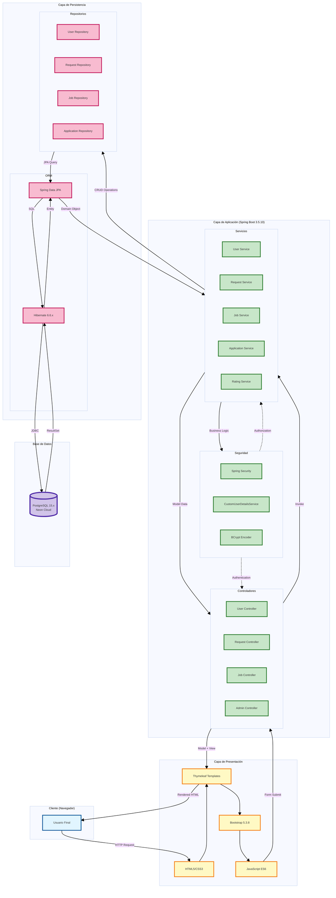

# Diseño Técnico de Duit

**Arquitectura, Componentes y Decisiones Técnicas de la Plataforma de Servicios**

---

## Tabla de Metadatos

| Propiedad                  | Valor                                                  |
| -------------------------- | ------------------------------------------------------ |
| **Nombre del Fichero**     | DAW_PRW_R1L2_UT01.4 - Diseño Técnico                   |
| **Versión**                | 3.0                                                    |
| **Fecha de Actualización** | 23 de febrero de 2026                                  |
| **Ciclo Formativo**        | Desarrollo de Aplicaciones Web - Semipresencial (DAWN) |
| **Módulo**                 | Proyecto de Desarrollo de Aplicaciones Web (PRW)       |
| **Autores**                | Aleixo Fernández Cuevas, Cristo Manuel Navarro Martín  |

---

## Tabla de Contenidos

- [Diseño Técnico de Duit](#diseño-técnico-de-duit)
  - [Tabla de Metadatos](#tabla-de-metadatos)
  - [Tabla de Contenidos](#tabla-de-contenidos)
  - [Tabla de Historial de Revisiones](#tabla-de-historial-de-revisiones)
  - [1. Introducción](#1-introducción)
    - [Propósito](#propósito)
  - [2. Información del Proyecto](#2-información-del-proyecto)
  - [3. Requisitos Técnicos](#3-requisitos-técnicos)
    - [3.1. Plataforma y Herramientas de Desarrollo](#31-plataforma-y-herramientas-de-desarrollo)
    - [3.2. Deployment](#32-deployment)
    - [3.3. Tecnologías Principales Frontend](#33-tecnologías-principales-frontend)
    - [3.4. Plataforma de Desarrollo](#34-plataforma-de-desarrollo)
    - [3.5. Persistencia](#35-persistencia)
      - [Tecnologías de Persistencia](#tecnologías-de-persistencia)
      - [Configuración de PostgreSQL](#configuración-de-postgresql)
      - [Pool de Conexiones HikariCP](#pool-de-conexiones-hikaricp)
      - [Migraciones y DDL](#migraciones-y-ddl)
    - [3.6. Seguridad](#36-seguridad)
    - [3.7. Validación y Email](#37-validación-y-email)
    - [3.8. Testing (scope: test)](#38-testing-scope-test)
  - [4. Gestión de Dependencias](#4-gestión-de-dependencias)
    - [Configuración de Proyecto Maven](#configuración-de-proyecto-maven)
    - [Dependencias de Producción](#dependencias-de-producción)
      - [Core Framework](#core-framework)
      - [Frontend - Plantillas](#frontend---plantillas)
      - [Base de Datos](#base-de-datos)
      - [Utilidades](#utilidades)
    - [Dependencias de Testing](#dependencias-de-testing)
    - [Configuración de Build](#configuración-de-build)
      - [Plugin Maven Compiler](#plugin-maven-compiler)
      - [Plugin Spring Boot Maven](#plugin-spring-boot-maven)
    - [Comandos Maven Comunes](#comandos-maven-comunes)
    - [Flujo de Resolución de Dependencias](#flujo-de-resolución-de-dependencias)
    - [Dependencias en Producción (Koyeb)](#dependencias-en-producción-koyeb)
  - [5. Arquitectura y Patrones](#5-arquitectura-y-patrones)
    - [Estructura General del Sistema](#estructura-general-del-sistema)
    - [5.1. Arquitectura MVC](#51-arquitectura-mvc)
    - [5.2. Patrón Repository](#52-patrón-repository)
    - [5.3. Inyección de Dependencias](#53-inyección-de-dependencias)
  - [6. Seguridad](#6-seguridad)
    - [6.1. Configuración de Spring Security](#61-configuración-de-spring-security)
      - [Autenticación Basada en Formulario](#autenticación-basada-en-formulario)
      - [Rutas Públicas (sin autenticación)](#rutas-públicas-sin-autenticación)
      - [Funcionalidad Remember Me](#funcionalidad-remember-me)
      - [Logout](#logout)
      - [Protección CSRF](#protección-csrf)
    - [6.2. CustomUserDetailsService](#62-customuserdetailsservice)
    - [6.3. Encriptación de Contraseñas](#63-encriptación-de-contraseñas)
    - [6.4. Control de Acceso Basado en Roles](#64-control-de-acceso-basado-en-roles)
    - [6.5. Auditoría de Seguridad](#65-auditoría-de-seguridad)
    - [6.6. Auditoría Automática de Entidades (BaseEntity)](#66-auditoría-automática-de-entidades-baseentity)
    - [6.7. Gestión de Errores HTTP Personalizada](#67-gestión-de-errores-http-personalizada)
  - [7. Integraciones Externas](#7-integraciones-externas)
    - [7.1. Neon PostgreSQL Cloud](#71-neon-postgresql-cloud)
    - [7.2. Koyeb PaaS](#72-koyeb-paas)
    - [7.3. Spring Mail (SMTP)](#73-spring-mail-smtp)
    - [7.4. Bitwarden (GitHub Integration)](#74-bitwarden-github-integration)
    - [7.5. GitHub](#75-github)
    - [Integraciones Futuras Planificadas](#integraciones-futuras-planificadas)
  - [8. Justificación de Tecnologías](#8-justificación-de-tecnologías)
    - [Notas de Diseño y Decisiones Arquitectónicas](#notas-de-diseño-y-decisiones-arquitectónicas)
      - [Enumerados Java para Estados](#enumerados-java-para-estados)
      - [Índices Estratégicos en Base de Datos](#índices-estratégicos-en-base-de-datos)
      - [Validación en Backend (no solo Frontend)](#validación-en-backend-no-solo-frontend)
      - [Lazy Loading para Relaciones](#lazy-loading-para-relaciones)
      - [Separación de Tablas Professional\_Category](#separación-de-tablas-professionalcategory)
      - [Spring Security Configuration sin CSRF en Desarrollo](#spring-security-configuration-sin-csrf-en-desarrollo)
      - [No Usar Microservicios (Monolito MVC)](#no-usar-microservicios-monolito-mvc)
    - [8.1. Frontend](#81-frontend)
    - [8.2. Backend](#82-backend)
    - [8.3. Herramientas](#83-herramientas)
    - [8.4. Despliegue](#84-despliegue)
  - [9. Reparto de Tareas y Responsabilidades](#9-reparto-de-tareas-y-responsabilidades)
    - [Cristo Manuel Navarro Martín](#cristo-manuel-navarro-martín)
    - [Aleixo Fernández Cuevas](#aleixo-fernández-cuevas)
    - [Coordinación y Trabajo en Equipo](#coordinación-y-trabajo-en-equipo)

---

## Tabla de Historial de Revisiones

| Fecha      | Descripción                              | Autores                            |
| ---------- | ---------------------------------------- | ---------------------------------- |
| 21/12/2025 | Fase de análisis. Versión inicial        | Aleixo F. Cuevas, Cristo N. Martín |
| 10/01/2026 | Primera corrección                       | Aleixo F. Cuevas, Cristo N. Martín |
| 16/02/2026 | Segunda corrección                       | Aleixo F. Cuevas, Cristo N. Martín |
| 16/02/2026 | Tercera corrección y reformateo completo | Aleixo F. Cuevas                   |
| 23/02/2026 | Cuarta corrección                        | Aleixo F. Cuevas, Cristo N. Martín |
| 24/02/2026 | Quinta corrección y revisión final       | Aleixo F. Cuevas, Cristo N. Martín |

---

## 1. Introducción

El presente documento describe el diseño técnico de la aplicación **Duit**, una plataforma web desarrollada utilizando **Spring Boot 3.5.10** y **Java 21**, siguiendo una arquitectura **MVC** (Modelo-Vista-Controlador) y empleando **PostgreSQL** como sistema de gestión de bases de datos.


### Propósito

El objetivo principal de este documento es servir como referencia técnica para:

- **Desarrollo**: Comprensión clara de la arquitectura y componentes del sistema
- **Mantenimiento**: Facilitar futuras modificaciones y mejoras
- **Despliegue**: Guía para implementación en entornos producción
- **Educación**: Contexto académico para estudiantes y desarrolladores


---

## 2. Información del Proyecto

| Atributo                     | Valor                                                              |
| ---------------------------- | ------------------------------------------------------------------ |
| **Nombre**                   | Duit                                                               |
| **Descripción**              | Plataforma de gestión de servicios y ofertas de trabajo            |
| **Versión Actual**           | 0.0.1-SNAPSHOT                                                     |
| **Framework Principal**      | Spring Boot 3.5.10                                                 |
| **Versión Java**             | 21 LTS (Soporte hasta 2029)                                        |
| **Base de Datos**            | PostgreSQL 15.x (Neon Cloud)                                       |
| **Servidor de Aplicaciones** | Tomcat embebido (10.1.x)                                           |
| **Motor de Plantillas**      | Thymeleaf 3.1.x                                                    |
| **Entorno de Producción**    | Koyeb (PaaS)                                                       |
| **Control de Versiones**     | Git / GitHub                                                       |
| **Repositorio**              | [https://github.com/FerCueA/Duit](https://github.com/FerCueA/Duit) |

---

## 3. Requisitos Técnicos

### 3.1. Plataforma y Herramientas de Desarrollo

La aplicación Duit se desarrolla utilizando tecnologías modernas ampliamente adoptadas en entornos profesionales, garantizando mantenibilidad, escalabilidad y compatibilidad.

| Herramienta        | Tipo                 | Propósito                                       |
| ------------------ | -------------------- | ----------------------------------------------- |
| Visual Studio Code | IDE                  | Desarrollo frontend y edición general           |
| Obsidian           | Editor MD            | Creación y edición de documentación en Markdown |
| Firefox / Brave    | Navegadores          | Pruebas funcionales y depuración                |
| Git                | Control de versiones | Gestión del código fuente                       |
| Figma              | Diseño               | Prototipado de interfaces                       |
| Trello             | Gestión              | Planificación y seguimiento de tareas           |
| DBeaver            | Gestión BD           | Administración de base de datos                 |

### 3.2. Deployment

| Tecnología | Tipo             | Propósito                        |
| ---------- | ---------------- | -------------------------------- |
| Koyeb      | PaaS             | Hosting de la aplicación web     |
| Neon       | PostgreSQL Cloud | Hosting PostgreSQL autocontenida |

### 3.3. Tecnologías Principales Frontend

| Tecnología      | Versión | Tipo                | Propósito                               |
| --------------- | ------- | ------------------- | --------------------------------------- |
| HTML5           | -       | Lenguaje de marcado | Estructura semántica de las páginas web |
| CSS3            | -       | Estilos             | Diseño visual y responsive              |
| JavaScript      | ES6     | Lenguaje            | Interactividad del lado del cliente     |
| Thymeleaf       | 3.1.x   | Template Engine     | Renderizado dinámico de vistas          |
| Bootstrap       | 5.3.8   | CSS Framework       | Diseño responsive y componentes UI      |
| Bootstrap Icons | 1.13.1  | Iconos              | Conjunto de iconos vectoriales          |
| Bootswatch      | Flatly  | Tema Bootstrap      | Tema aplicado sobre Bootstrap 5.3.8     |

**Nota sobre Temas**: La aplicación utiliza el tema **Flatly** de [Bootswatch](https://bootswatch.com/flatly/). La referencia general de la librería se encuentra en [https://bootswatch.com/](https://bootswatch.com/). Este tema se integra de forma transparente con Bootstrap y mejora la consistencia visual de la interfaz.

### 3.4. Plataforma de Desarrollo

| Tecnología        | Versión | Tipo       | Propósito                                  |
| ----------------- | ------- | ---------- | ------------------------------------------ |
| Java              | 21 LTS  | Lenguaje   | Base del proyecto, soporte hasta 2029      |
| Spring Boot       | 3.5.10  | Framework  | Framework principal y autoconfiguracion    |
| Spring Framework  | 6.2.x   | Framework  | Núcleo de Spring (dependencia transitiva)  |
| Maven             | 3.9+    | Build Tool | Gestión de dependencias y proceso de build |
| Tomcat (embebido) | 10.1.x  | Servidor   | Servidor web integrado                     |

### 3.5. Persistencia

#### Tecnologías de Persistencia

| Tecnología              | Versión | Tipo           | Propósito                                    |
| ----------------------- | ------- | -------------- | -------------------------------------------- |
| Spring Data JPA         | 3.5.x   | Framework      | Abstracción de acceso a datos                |
| Hibernate ORM           | 6.6.x   | ORM            | Implementación JPA (mapeo objeto-relacional) |
| Hibernate Validator     | 8.0.x   | Validación     | Bean Validation en entidades                 |
| PostgreSQL Driver       | 42.7.x  | Driver JDBC    | Conector JDBC para PostgreSQL                |
| HikariCP                | 5.1.x   | Pool           | Pool de conexiones optimizado                |
| Jakarta Persistence API | 3.1.0   | Especificación | Especificación JPA                           |

#### Configuración de PostgreSQL

**Base de Datos:**

| Parámetro     | Valor                             |
| ------------- | --------------------------------- |
| **Proveedor** | Neon (PostgreSQL 15.x en la nube) |
| **Host**      | Neon serverless endpoint          |
| **Puerto**    | 5432 (default PostgreSQL)         |

**Credenciales (variables de entorno):**

```
DB_URL=jdbc:postgresql://[neon-host]:5432/duit_db
DB_USER=duit_user
DB_PASS=[contraseña]
```

**Configuración en application.properties:**

```properties
# Conexión base de datos
spring.datasource.url=${DB_URL}
spring.datasource.username=${DB_USER}
spring.datasource.password=${DB_PASS}
spring.datasource.driver-class-name=org.postgresql.Driver

# Configuración HikariCP (pool de conexiones)
spring.datasource.hikari.maximum-pool-size=20
spring.datasource.hikari.minimum-idle=5
spring.datasource.hikari.idle-timeout=300000
spring.datasource.hikari.max-lifetime=600000
spring.datasource.hikari.connection-timeout=30000
spring.datasource.hikari.validation-timeout=5000
spring.datasource.hikari.leak-detection-threshold=60000

# Configuración JPA/Hibernate
spring.jpa.hibernate.ddl-auto=update
spring.jpa.properties.hibernate.jdbc.time_zone=Europe/Madrid
spring.jpa.open-in-view=true
```

#### Pool de Conexiones HikariCP

HikariCP es un pool de alto rendimiento que gestiona reutilización de conexiones:

| Parámetro          | Valor  | Explicación                      |
| ------------------ | ------ | -------------------------------- |
| maximum-pool-size  | 20     | Máximo 20 conexiones simultáneas |
| minimum-idle       | 5      | Mantiene 5 conexiones listas     |
| idle-timeout       | 5 min  | Cierra conexiones inactivas      |
| max-lifetime       | 10 min | Renueva conexiones               |
| connection-timeout | 30 seg | Timeout para obtener conexión    |
| leak-detection     | 60 seg | Alerta de fugas                  |

#### Migraciones y DDL

**Estrategia: spring.jpa.hibernate.ddl-auto=update**

- **En desarrollo**: Hibernate crea/modifica tablas automáticamente
- **En producción**: Recomendado cambiar a `validate` o `none`

**Scripts:**

- `schema.sql` en documentación/ contiene definición completa
- Índices y constraints ya configurados
- Compatible con DBeaver local

### 3.6. Seguridad

| Tecnología             | Versión  | Tipo      | Propósito                    |
| ---------------------- | -------- | --------- | ---------------------------- |
| Spring Security        | 6.4.x    | Framework | Autenticación y autorización |
| Spring Security Web    | 6.4.x    | Módulo    | Filtros HTTP                 |
| Spring Security Config | 6.4.x    | Módulo    | Configuración de seguridad   |
| BCrypt                 | Incluido | Algoritmo | Hash seguro de contraseñas   |
| Bitwarden (GitHub)     | -        | Gestor    | Gestión de credenciales      |

### 3.7. Validación y Email

| Tecnología         | Versión | Tipo           | Propósito           | Estado       |
| ------------------ | ------- | -------------- | ------------------- | ------------ |
| Spring Validation  | 3.5.x   | Framework      | Validación de datos | Implementado |
| Jakarta Validation | 3.0.2   | Especificación | Bean Validation     | Implementado |
| Spring Mail        | 3.5.x   | Framework      | Envío de correos    | Planificado  |
| Jakarta Mail       | 2.0.x   | API            | JavaMail API        | Planificado  |

**Nota sobre Email**: La dependencia `spring-boot-starter-mail` está incluida en `pom.xml`, pero la configuración SMTP (host, puerto, credenciales) no está configurada en `application.properties`. Requiere:
- Proveedor SMTP elegido (Gmail, SendGrid, etc.)
- Credenciales configuradas en variables de entorno
- Implementación de servicios de email en los casos de uso requeridos

### 3.8. Testing (scope: test)

| Tecnología           | Versión | Tipo      | Propósito              | Estado      |
| -------------------- | ------- | --------- | ---------------------- | ----------- |
| JUnit Jupiter        | 5.11.x  | Framework | Testing unitario       | Configurado |
| Mockito              | 5.14.x  | Framework | Mocking                | Configurado |
| AssertJ              | 3.26.x  | Librería  | Assertions fluidas     | Configurado |
| Spring Boot Test     | 3.5.10  | Framework | Testing de integración | Configurado |
| Spring Security Test | 6.4.x   | Framework | Testing de seguridad   | Configurado |
| Hamcrest             | 3.0.x   | Librería  | Matchers               | Configurado |

**Estado Actual del Testing**:

- **Dependencias**: Todas las librerías de testing están configuradas en `pom.xml`
- **Cobertura**: Actualmente solo existe 1 test básico (`DuitApplicationTests.java`) que verifica que el contexto carga correctamente
- **Próximos pasos**: Implementar tests unitarios para servicios y tests de integración para controladores y flujos críticos

---

## 4. Gestión de Dependencias

La aplicación Duit utiliza **Maven** como herramienta de gestión de dependencias, permitiendo un control centralizado de versiones y garantizando compatibilidad entre componentes.

### Configuración de Proyecto Maven

**Identificación del Proyecto:**

```xml
<groupId>es.duit</groupId>
<artifactId>duit</artifactId>
<version>0.0.1-SNAPSHOT</version>
<name>duit</name>
<description>Aplicación web orientada a la gestión de servicios y ofertas de trabajo</description>
```

**Parent POM:**

```xml
<parent>
  <groupId>org.springframework.boot</groupId>
  <artifactId>spring-boot-starter-parent</artifactId>
  <version>3.5.10</version>
</parent>
```

**Configuración de Java:**

```xml
<properties>
  <java.version>21</java.version>
</properties>
```

### Dependencias de Producción

#### Core Framework

| Dependencia                    | Clasificación | Versión | Propósito                                    |
| ------------------------------ | ------------- | ------- | -------------------------------------------- |
| spring-boot-starter-web        | Spring Boot   | 3.5.10  | Framework principal, controladores HTTP/REST |
| spring-boot-starter-data-jpa   | Spring Boot   | 3.5.10  | Persistencia de datos con JPA/Hibernate      |
| spring-boot-starter-security   | Spring Boot   | 3.5.10  | Autenticación y autorización                 |
| spring-boot-starter-validation | Spring Boot   | 3.5.10  | Validación de datos (Jakarta Validation)     |
| spring-boot-starter-mail       | Spring Boot   | 3.5.10  | Envío de correos SMTP                        |
| spring-boot-starter-actuator   | Spring Boot   | 3.5.10  | Métricas y health checks                     |

#### Frontend - Plantillas

| Dependencia                      | Clasificación | Versión | Propósito                                |
| -------------------------------- | ------------- | ------- | ---------------------------------------- |
| spring-boot-starter-thymeleaf    | Spring Boot   | 3.5.10  | Motor de plantillas HTML dinámicas       |
| thymeleaf-extras-springsecurity6 | Thymeleaf     | 6.x     | Integración de Spring Security en vistas |

#### Base de Datos

| Dependencia | Clasificación | Versión       | Alcance | Propósito                   |
| ----------- | ------------- | ------------- | ------- | --------------------------- |
| postgresql  | PostgreSQL    | Latest (15.x) | runtime | Driver JDBC para PostgreSQL |

> **Nota**: Spring Data JPA incluye Hibernate automáticamente como implementación ORM. La conexión a la base de datos se configura mediante variables de entorno (DB_URL, DB_USER, DB_PASS).

#### Utilidades

| Dependencia   | Clasificación | Versión | Propósito                                                              |
| ------------- | ------------- | ------- | ---------------------------------------------------------------------- |
| lombok        | Librería      | 1.18.32 | Reducción de código boilerplate (@Getter, @Setter, @NoArgsConstructor) |
| spring-dotenv | Librería      | 3.0.0   | Carga de variables de entorno desde archivo .env                       |

### Dependencias de Testing

| Dependencia              | Clasificación   | Versión | Alcance | Propósito                                                |
| ------------------------ | --------------- | ------- | ------- | -------------------------------------------------------- |
| spring-boot-starter-test | Spring Boot     | 3.5.10  | test    | Testing unitario e integración (JUnit, Mockito, AssertJ) |
| spring-security-test     | Spring Security | 6.4.x   | test    | Testing de endpoints protegidos                          |

### Configuración de Build

#### Plugin Maven Compiler

```xml
<plugin>
  <groupId>org.apache.maven.plugins</groupId>
  <artifactId>maven-compiler-plugin</artifactId>
  <version>3.11.0</version>
  <configuration>
    <source>21</source>
    <target>21</target>
    <annotationProcessorPaths>
      <path>
        <groupId>org.projectlombok</groupId>
        <artifactId>lombok</artifactId>
        <version>1.18.32</version>
      </path>
    </annotationProcessorPaths>
  </configuration>
</plugin>
```

**Propósito**: Compilación de código fuente con Java 21 y procesamiento de anotaciones de Lombok.

#### Plugin Spring Boot Maven

```xml
<plugin>
  <groupId>org.springframework.boot</groupId>
  <artifactId>spring-boot-maven-plugin</artifactId>
  <configuration>
    <excludes>
      <exclude>
        <groupId>org.projectlombok</groupId>
        <artifactId>lombok</artifactId>
      </exclude>
    </excludes>
  </configuration>
</plugin>
```

**Propósito**: Empaquetamiento como JAR ejecutable. Lombok se excluye del JAR final (no es necesario en runtime).

### Comandos Maven Comunes

```bash
# Compilar el proyecto
mvn clean compile

# Ejecutar tests
mvn test

# Construir JAR
mvn clean package

# Ejecutar aplicación en desarrollo
mvn spring-boot:run

# Instalar en repositorio local
mvn install

# Limpiar archivos generados
mvn clean
```

### Flujo de Resolución de Dependencias

1. **Phase: Initialize** → Lee pom.xml
2. **Phase: Validate & Compile** → Descarga dependencias desde repositorios remotos (Maven Central)
3. **Phase: Process** → Ejecuta annotation processors (Lombok)
4. **Phase: Package** → Empaqueta como JAR ejecutable con todas las dependencias incluidas
5. **Phase: Verify** → Ejecuta tests y validaciones
6. **Phase: Deploy** → Prepara para despliegue (en Koyeb, se usa `mvn clean package -DskipTests`)

### Dependencias en Producción (Koyeb)

Cuando se despliega en Koyeb:

- Maven se ejecuta automáticamente: `mvn clean package -DskipTests`
- Se genera un JAR con todas las dependencias embebidas (fat JAR)
- Spring Boot inicia con: `java -jar duit-0.0.1-SNAPSHOT.jar`
- Las dependencias de test NO se incluyen en el JAR final


---

## 5. Arquitectura y Patrones

Durante el desarrollo de la aplicación Duit se han aplicado patrones de diseño y principios arquitectónicos ampliamente utilizados en el ecosistema Spring, con el objetivo de garantizar un sistema modular, mantenible y escalable.

**Decisión Arquitectónica Fundamental**: Monolito MVC bien estructurado en lugar de microservicios, apropiado para la fase actual de desarrollo de la aplicación.

### Estructura General del Sistema



### 5.1. Arquitectura MVC

La aplicación sigue el patrón **MVC** (Modelo-Vista-Controlador), separando claramente las responsabilidades entre:

| Componente      | Descripción                                                                                                                                                 |
| --------------- | ----------------------------------------------------------------------------------------------------------------------------------------------------------- |
| **Modelo**      | Entidades JPA y lógica de dominio. Representa la estructura de datos y las reglas de negocio (11 entidades implementadas).                                  |
| **Vista**       | Plantillas Thymeleaf encargadas de la presentación. Renderiza HTML dinámico para el usuario (8+ plantillas con Bootstrap).                                  |
| **Controlador** | Componentes responsables de gestionar las peticiones HTTP y coordinar la lógica de negocio. Orquesta interacciones entre Modelo y Vista (13 controladores). |

**Controladores Implementados**:

| Controlador               | Propósito                                                     |
| ------------------------- | ------------------------------------------------------------- |
| `AdminController`         | Acceso a vistas base administrativas (usuarios, estadísticas) |
| `CategoryController`      | Gestión de categorías de servicios                            |
| `DashboardController`     | Panel de control principal del usuario                        |
| `MyRequestsController`    | Gestión de solicitudes propias del usuario                    |
| `PostulacionesController` | Gestión de candidaturas/postulaciones                         |
| `ProfessionalController`  | Gestión de perfiles profesionales                             |
| `ProfileController`       | Edición de perfiles de usuario                                |
| `PublicController`        | Páginas públicas (índice, ayuda, términos)                    |
| `RatingsController`       | Gestión de valoraciones y reseñas                             |
| `RequestFormController`   | Formularios de creación de solicitudes                        |
| `SharedController`        | Funcionalidades compartidas entre tipos de usuario            |
| `CustomErrorController`   | Manejo de errores HTTP                                        |
| `UserControllerAdvice`    | Manejo centralizado de excepciones                            |

Esta separación mejora la mantenibilidad del código y facilita la evolución independiente de cada capa.

### 5.2. Patrón Repository

Se utiliza el patrón **Repository** mediante **Spring Data JPA** para desacoplar el acceso a datos de la lógica de negocio.

Los repositorios actúan como una abstracción sobre la capa de persistencia, permitiendo:

- Reducir el acoplamiento entre capas
- Facilitar el cambio o ampliación del sistema de persistencia
- Simplificar la escritura y el mantenimiento del código

### 5.3. Inyección de Dependencias

La gestión de componentes se realiza mediante el mecanismo de **inyección de dependencias** proporcionado por el **Spring Framework**.

Este enfoque permite:

- Reducir dependencias directas entre clases
- Facilitar la reutilización y el testeo de componentes
- Centralizar la configuración y el ciclo de vida de los objetos

En conjunto, estas decisiones arquitectónicas contribuyen a un diseño limpio y alineado con las buenas prácticas de desarrollo de aplicaciones empresariales en Java.

---

## 6. Seguridad

### 6.1. Configuración de Spring Security

El sistema implementa mecanismos de autenticación y autorización mediante **Spring Security 6**, centralizados en la clase de configuración `SecurityConfig`.

#### Autenticación Basada en Formulario

| Parámetro                           | Valor             |
| ----------------------------------- | ----------------- |
| **Página de login**                 | /login            |
| **URL de procesamiento**            | /login            |
| **Redirección tras login correcto** | /home             |
| **Redirección en caso de error**    | /login?error=true |

#### Rutas Públicas (sin autenticación)

| Categoría                    | Rutas                                |
| ---------------------------- | ------------------------------------ |
| **Rutas principales**        | /, /index, /public/**                |
| **Autenticación y registro** | /login, /signup, /register           |
| **Recursos estáticos**       | /css/**, /js/**, /img/**, /static/** |
| **Páginas informativas**     | /privacy, /terms, /help              |

#### Funcionalidad Remember Me

| Parámetro                  | Valor                      |
| -------------------------- | -------------------------- |
| **Validez del token**      | 24 horas (86,400 segundos) |
| **Gestión de cookies**     | Automática                 |
| **Persistencia de sesión** | Segura                     |

#### Logout

| Operación                          | Descripción                     |
| ---------------------------------- | ------------------------------- |
| **Invalidación de la sesión HTTP** | Termina la sesión activa        |
| **Eliminación de cookies**         | Limpia cookies de autenticación |
| **Redirección**                    | /login?logout=true              |

#### Protección CSRF

| Estado            | Entorno             | Razón                                           |
| ----------------- | ------------------- | ----------------------------------------------- |
| **Deshabilitado** | Desarrollo (actual) | Forma-based authentication, simplificar testing |
| **Recomendado**   | Producción (futuro) | Protección contra ataques cross-site            |

### 6.2. CustomUserDetailsService

Clase responsable de cargar los datos del usuario desde la base de datos para el proceso de autenticación.

**Funcionalidades:**

- Implementa la interfaz `UserDetailsService` de Spring Security
- Carga usuarios mediante username (email)
- Conversión de la entidad AppUser a UserDetails
- Gestión de roles y autoridades

### 6.3. Encriptación de Contraseñas

La aplicación utiliza el algoritmo **BCrypt** para el cifrado seguro de contraseñas.

**Configuración:**

```java
@Bean
public PasswordEncoder passwordEncoder() {
  return new BCryptPasswordEncoder();
}
```

**Características:**

- Generación automática de salt por contraseña
- Alta resistencia a ataques de fuerza bruta
- Coste computacional configurable

### 6.4. Control de Acceso Basado en Roles

El sistema implementa control de acceso basado en roles (RBAC) en la configuración de Spring Security.

**Roles activos en autorización de rutas:**

| Rol              | Descripción                                | Rutas Protegidas                      |
| ---------------- | ------------------------------------------ | ------------------------------------- |
| **ADMIN**        | Administrador del sistema                  | /admin/**, /user/**, /professional/** |
| **USER**         | Usuario estándar (demandante de servicios) | /user/**, rutas genéricas             |
| **PROFESSIONAL** | Profesional oferente de servicios          | /professional/**, /user/**            |

**Nota:** El modelo de datos incluye también el rol `MODERATOR` para ampliaciones futuras, pero no tiene rutas específicas activas en la versión actual.

**Configuración en SecurityConfig:**

```java
.authorizeHttpRequests(auth -> auth
    .requestMatchers("/admin/**").hasRole("ADMIN")
    .requestMatchers("/user/**").hasAnyRole("USER", "ADMIN")
    .requestMatchers("/professional/**").hasAnyRole("PROFESSIONAL", "ADMIN")
    .anyRequest().authenticated())
```

**Control de Acceso en Vistas:**

Las plantillas Thymeleaf utilizan `sec:authorize` para mostrar/ocultar contenido basado en roles:

```html
<div sec:authorize="hasRole('ADMIN')">
    <!-- Contenido solo visible para administradores -->
</div>
```

### 6.5. Auditoría de Seguridad

El sistema incorpora mecanismos de auditoría para el seguimiento de accesos mediante un **registro de accesos (Access Log)**.

**Información registrada:**

| Campo                      | Descripción                                |
| -------------------------- | ------------------------------------------ |
| **Intentos de acceso**     | Registro de intentos de entrada al sistema |
| **Dirección IP de origen** | IP desde la que se realiza el acceso       |
| **Marca temporal**         | Fecha y hora del evento                    |
| **Resultado del acceso**   | Éxito o fallo de la autenticación          |

### 6.6. Auditoría Automática de Entidades (BaseEntity)

La aplicación implementa una clase base común `BaseEntity` que proporciona auditoría automática a todas las entidades que la heredan.

**Atributos Auditados:**

- `createdAt`: Timestamp de creación
- `updatedAt`: Timestamp de última actualización
- `createdBy`: Usuario que creó el registro
- `updatedBy`: Usuario que realizó la última modificación

### 6.7. Gestión de Errores HTTP Personalizada

El sistema implementa una gestión explícita de errores HTTP mediante controlador dedicado y vistas personalizadas en Thymeleaf.

**Componentes involucrados:**

- `CustomErrorController` para centralizar resolución de errores
- Plantilla `templates/error/403.html` para accesos denegados
- Plantilla `templates/error/404.html` para recursos no encontrados
- Plantilla `templates/error/500.html` para errores internos

**Comportamiento de seguridad asociado:**

- Redirección a `/error/403` cuando Spring Security detecta falta de permisos
- Desactivación de la página Whitelabel por defecto (`server.error.whitelabel.enabled=false`)
- Ocultación de detalles técnicos en producción mediante `server.error.include-* = never`

**Objetivo técnico:**

- Mejorar la experiencia de usuario ante fallos
- Mantener consistencia visual con el resto de la aplicación
- Reducir exposición de información sensible en respuestas de error

---

## 7. Integraciones Externas

La aplicación Duit integra servicios externos para proporcionar funcionalidades de infraestructura, persistencia y seguridad sin necesidad de gestión propia de servidores.

### 7.1. Neon PostgreSQL Cloud

**Tipo**: Base de Datos como Servicio (DBaaS)

**Propósito**: Hosting de la base de datos PostgreSQL en la nube con arquitectura serverless.

**Características**:
- PostgreSQL 15.x totalmente gestionado
- Escalado automático según demanda
- Backups automáticos y point-in-time recovery
- Branching de base de datos para desarrollo
- Sin administración de infraestructura

**Configuración**:
```properties
spring.datasource.url=${DB_URL}
spring.datasource.username=${DB_USER}
spring.datasource.password=${DB_PASS}
```

**Ventajas**:
- Alta disponibilidad sin configuración adicional
- Latencia optimizada para aplicaciones PaaS
- Tier gratuito para desarrollo y pruebas

### 7.2. Koyeb PaaS

**Tipo**: Platform as a Service

**Propósito**: Despliegue y hosting de la aplicación Spring Boot en producción.

**Características**:
- Despliegue automático desde GitHub
- Build automático con Maven
- Escalado horizontal automático
- SSL/HTTPS incluido
- Monitoreo y logs integrados

**Flujo de Despliegue**:
1. Push a rama main en GitHub
2. Koyeb detecta cambios y ejecuta `mvn clean package -DskipTests`
3. Despliega JAR ejecutable
4. Configura variables de entorno (DB_URL, DB_USER, DB_PASS)
5. Inicia aplicación con `java -jar duit-0.0.1-SNAPSHOT.jar`

**Ventajas**:
- CI/CD automático sin configuración
- Sin gestión de contenedores o servidores
- Escalado basado en tráfico

### 7.3. Spring Mail (SMTP)

**Tipo**: Servicio de correo electrónico

**Propósito**: Envío de notificaciones por email a usuarios (registro, cambios de estado, mensajes).

**Dependencia**:
```xml
<dependency>
  <groupId>org.springframework.boot</groupId>
  <artifactId>spring-boot-starter-mail</artifactId>
</dependency>
```

**Estado Actual**:
- Dependencia incluida en `pom.xml`
- Configuración SMTP NO implementada
- Servicios de email NO desarrollados

**Configuración requerida** (próximas fases):

Para habilitar envío de emails, es necesario configurar en `application.properties` o variables de entorno:

```properties
spring.mail.host=${MAIL_HOST}       # smtp.gmail.com, etc.
spring.mail.port=${MAIL_PORT}       # 587 o 465
spring.mail.username=${MAIL_USER}   # usuario@example.com
spring.mail.password=${MAIL_PASS}   # contraseña o API key
spring.mail.properties.mail.smtp.auth=true
spring.mail.properties.mail.smtp.starttls.enable=true
spring.mail.properties.mail.smtp.starttls.required=true
```

**Proveedores Recomendados**:
- Gmail SMTP
- SendGrid
- Mailgun
- AWS SES

### 7.4. Bitwarden (GitHub Integration)

**Tipo**: Gestor de credenciales

**Propósito**: Almacenamiento seguro de credenciales y secretos del proyecto (claves de BD, tokens API, etc.).

**Integración**:
- Repositorio GitHub conectado con Bitwarden
- Credenciales compartidas entre el equipo de forma segura
- Sin exposición de secretos en código o commits

**Ventajas**:
- Centralización de secretos
- Control de acceso por usuario
- Auditoría de acceso a credenciales
- Sincronización con GitHub Actions (potencial futuro)

### 7.5. GitHub

**Tipo**: Control de versiones y colaboración

**Propósito**: Repositorio de código fuente y sistema de integración continua.

**Repositorio**: [https://github.com/FerCueA/Duit](https://github.com/FerCueA/Duit)

**Características utilizadas**:
- Control de versiones Git
- Colaboración entre desarrolladores
- Integración con Koyeb para despliegue automático
- Issues y project management (opcional)

**Flujo de trabajo**:
- Desarrollo local → Commit → Push a GitHub
- GitHub Webhook → Trigger Koyeb deployment
- Build automático → Despliegue a producción

### Integraciones Futuras Planificadas

| Servicio               | Tipo                    | Propósito                       | Prioridad | Estado           |
| ---------------------- | ----------------------- | ------------------------------- | --------- | ---------------- |
| Email (SMTP)           | Correo electrónico      | Notificaciones transaccionales  | Alta      | En planificación |
| Cloudinary / AWS S3    | Almacenamiento de files | Imágenes de perfil y archivos   | Media     | En planificación |
| Google Maps API        | Geolocalización         | Mapas de ubicación de servicios | Media     | En planificación |
| Stripe / PayPal        | Pasarela de pago        | Procesamiento de pagos          | Baja      | En planificación |
| Twilio / SendGrid      | SMS y notificaciones    | SMS y emails transaccionales    | Baja      | Futura           |
| OAuth2 (Google/GitHub) | Autenticación           | Login social                    | Baja      | Futura           |

---

## 8. Justificación de Tecnologías

### Notas de Diseño y Decisiones Arquitectónicas

#### Enumerados Java para Estados

**Decisión**: Usar Java Enum para representar estados (DRAFT, PUBLISHED, COMPLETED, etc).

**Justificación**:

1. **Type Safety**: El compilador previene valores inválidos
2. **Prevención de Bugs**: Evita comparaciones erróneas de strings ("Published" != "PUBLISHED")
3. **Switch Statements**: Los enums funcionan perfectamente con switch/case
4. **Validación en BD**: PostgreSQL puede usar CHECK constraints para enums
5. **Documentación**: El enum mismo documenta los valores válidos

Ejemplo:

```java
public enum Status {
    DRAFT("Borrador"),
    PUBLISHED("Publicada"),
    COMPLETED("Completada"),
    CANCELLED("Cancelada");
}
```

#### Índices Estratégicos en Base de Datos

**Decisión**: Definir índices en columnas de consulta frecuente usando @Index.

**Justificación**:

1. **Rendimiento**: Búsquedas por status, usuario, categoría son O(log n) en lugar de O(n)
2. **Evita Full Table Scans**: AppUser.username (login) necesita índice para rendimiento
3. **Composite Indexes**: servicejob(status, start_date) optimiza consultas combinadas
4. **Trade-off Consciente**: Índices ralentizan writes pero aceleran reads (reads > writes en Duit)

#### Validación en Backend (no solo Frontend)

**Decisión**: Utilizar Jakarta Validation (@NotNull, @Size, @DecimalMin) en entidades.

**Justificación**:

1. **Seguridad**: El frontend puede ser bypasseado; el backend no
2. **Consistencia**: Una sola fuente de "verdad" para reglas de validación
3. **Mejor UX**: Mensajes de error coherentes en todas partes
4. **Eficiencia**: Detiene requests inválidos antes de llegar a servicios/BD

#### Lazy Loading para Relaciones

**Decisión**: Usar @OneToMany(fetch = FetchType.LAZY) en la mayoría de relaciones.

**Justificación**:

1. **Rendimiento**: No cargo todas las relaciones automáticamente
2. **Evita N+1 Queries**: Control explícito de qué cargar
3. **Memoria**: Objetos más livianos en casos donde no necesito relaciones
4. **Flexibility**: Puedo usar @Query custom o EntityGraph cuando necesito joins

#### Separación de Tablas Professional_Category

**Decisión**: Crear tabla intermedia professional_category para relación Many-to-Many.

**Justificación**:

1. **Normalización**: Evita redundancia entre profesionales y categorías
2. **Flexibilidad**: Un profesional puede ofrecer servicios en múltiples categorías
3. **Escalabilidad**: Fácil agregar atributos a la relación en el futuro (ej: experiencia_años)
4. **Integridad**: Cambiar/eliminar categoría no afecta profesionales directamente

#### Spring Security Configuration sin CSRF en Desarrollo

**Decisión**: Deshabilitar CSRF en development pero habilitarlo en producción.

**Justificación**:

1. **Testing Simplificado**: No necesito generar tokens en cada request durante desarrollo
2. **UX en Producción**: CSRF = seguridad crítica contra ataques cross-site
3. **Remember-me Seguro**: Tokens encrypted, no accesibles a JavaScript
4. **Cookie HTTP-only**: Previene XSS robando sesiones

#### No Usar Microservicios (Monolito MVC)

**Decisión**: Monolito Spring Boot bien estructurado en lugar de microservicios.

**Justificación**:

1. **Simplicidad**: Una aplicación, una BD, un deployment
2. **Mejor para MVP**: Microservicios añaden complejidad operacional no necesaria
3. **Performance**: Sin latencia de network entre servicios
4. **Transacciones ACID**: Fácil usar @Transactional dentro de una aplicación
5. **Future-proof**: Migración a microservicios es posible separando bounded contexts

### 8.1. Frontend

- **HTML5/CSS3/Bootstrap**: Estándares web modernos, compatibilidad multiplataforma, componentes UI reutilizables
- **JavaScript ES6**: Lenguaje de facto para web, amplio ecosistema
- **Thymeleaf**: Integración nativa con Spring, procesamiento del lado del servidor

### 8.2. Backend

- **Spring Boot 3.5.10**: Framework maduro, característica auto-configuración, vasto ecosistema
- **Java 21 LTS**: Soporte garantizado hasta 2029, mejoras de lenguaje, rendimiento

### 8.3. Herramientas

- **Maven**: Gestión de dependencias estándar, reproducibilidad, builds predecibles
- **Git/GitHub**: Control de versiones distribuido, integración con Koyeb

### 8.4. Despliegue

- **Koyeb**: PaaS simplificado, sin gestión de infraestructura, scaling automático
- **Neon PostgreSQL**: Base de datos gestionada, backups automáticos, sin administración

---

## 9. Reparto de Tareas y Responsabilidades

El desarrollo de la aplicación Duit se ha realizado de forma colaborativa, distribuyendo las tareas entre los miembros del equipo según sus responsabilidades y aportaciones al proyecto.

### Cristo Manuel Navarro Martín

**Responsable del desarrollo principal de la aplicación y del despliegue en producción.**

**Tareas realizadas:**

- Diseño de la arquitectura general del sistema (MVC)
- Implementación de la lógica de negocio y servicios
- Desarrollo de la capa de persistencia mediante Spring Data JPA y Hibernate
- Configuración e implementación de Spring Security:
  - Sistema de autenticación
  - Remember-me
  - Registro de accesos
  - Autorización por roles (planificada)
- Implementación del sistema de auditoría automática de entidades (BaseEntity)

### Aleixo Fernández Cuevas

**Responsable del diseño de la interfaz de usuario, apoyo al desarrollo y documentación.**

**Tareas realizadas:**

- Diseño de la interfaz de usuario con HTML5, CSS3 y Bootstrap
- Prototipado de interfaces utilizando Figma
- Configuración del despliegue en producción mediante Koyeb
- Integración y gestión de la base de datos PostgreSQL en Neon
- Redacción principal y documentación asociada
- Revisión y corrección de la documentación del proyecto

### Coordinación y Trabajo en Equipo

Ambos integrantes han participado conjuntamente en:

- Definición de los requisitos técnicos y funcionales
- Desarrollo parcial del backend con Spring Boot y Java 21
- Creación y adaptación de vistas dinámicas mediante Thymeleaf
- Toma de decisiones tecnológicas
- Control de versiones mediante Git y GitHub

---

**Última actualización:** 24 de febrero de 2026  
**Versión:** 3.0  
**Estado del Proyecto:** En desarrollo - Fase 2 (Pruebas y Refinamiento)
